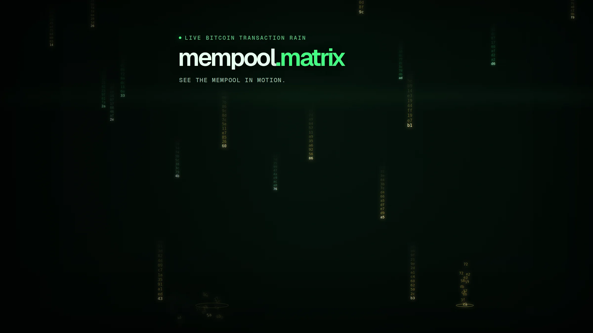

<p align="center">
  <picture>
    <source media="(max-width: 640px)" srcset="docs/assets/readme-hero-mobile.webp">
    
  </picture>
</p>

<h1 align="center">mempool.matrix</h1>

<p align="center">A cinematic, self-hosted view of Bitcoin's mempool.</p>

<p align="center">
  <a href="https://github.com/MiguelMedeiros/mempool-matrix/actions/workflows/ci.yml"></a>
  <a href="LICENSE"></a>
  <a href="package.json"></a>
</p>

<p align="center">
  <a href="#quick-start">Quick start</a> ·
  <a href="#configuration">Configuration</a> ·
  <a href="#documentation">Documentation</a> ·
  <a href="docs/umbrel.md">Umbrel</a>
</p>

## See Bitcoin transactions differently

Mempool Matrix turns live Bitcoin mempool activity into responsive digital rain.
Fee rate drives each transaction's color, brightness, speed, and urgency while a
compact HUD keeps the underlying data visible.

The application is a visualization and educational explorer. It is not a wallet,
node, or source of fee guarantees.

## Highlights

- Five visual modes: Matrix rain, constellation, fee heatmap, block race, and ambient fullscreen
- Live fee recommendations, mempool pressure, block telemetry, and transaction arrival rate
- Transaction search and detail views for inputs, outputs, scripts, witness data, outspends, and raw hex
- Historical mempool and fee charts with configurable collection and retention
- Runtime switching between mempool.space-compatible APIs
- Responsive canvas, mobile controls, installable PWA shell, and last-known snapshot

## Quick start

### Docker Compose

Clone the repository and build the current image locally:

```bash
git clone https://github.com/MiguelMedeiros/mempool-matrix.git
cd mempool-matrix
docker compose up -d --build
```

Open <http://localhost:3033>. Check container health with:

```bash
curl --fail http://localhost:3033/api/health
```

Compose persists runtime configuration and history in the `mempool-matrix-data`
named volume. The standalone runtime runs as UID/GID `1000:1000`.
See [Docker deployment](docs/docker.md) for backup, restore, and migration steps
before exposing or upgrading the app.

> **Privacy:** the default source is `https://mempool.space/api`. Requests for
> mempool and transaction data therefore reach that service. Point the app at
> your own compatible API for a local data path.

### Local development

Node.js 20.9 or newer and npm are required.

```bash
npm ci
npm run dev
```

Open <http://localhost:3000>. Run the production build with:

```bash
npm run build
npm run start
```

## Configuration

The data source is selected in this order:

1. A valid runtime configuration file
2. `MEMPOOL_API_URL`
3. `https://mempool.space/api`

Runtime source settings are read-only by default. Set a strong
`MEMPOOL_SETTINGS_TOKEN` to enable tests and updates, then unlock settings in the
interface.
For trusted local development only, an explicit unauthenticated opt-in is
available.

A source must expose a mempool.space-compatible REST API over HTTP(S). Raw
Bitcoin Core RPC is not supported.

See the [complete environment reference](docs/configuration.md), including
history, proxy trust, source deny hosts, timeouts, and local API examples.

## Umbrel

Umbrel packaging is still a draft. It has not been submitted to or listed in the
official App Store. See [Umbrel packaging status](docs/umbrel.md).

## Documentation

| Guide | Contents |
| --- | --- |
| [Documentation index](docs/README.md) | All public guides |
| [Configuration](docs/configuration.md) | Environment, precedence, source settings, and history |
| [Architecture](docs/architecture.md) | UI, server routes, safe fetching, and persistence |
| [Security](docs/security.md) | Threat model, SSRF controls, authentication, and deployment boundaries |
| [Docker](docs/docker.md) | Current Compose workflow, persistence, health, and image status |
| [Umbrel](docs/umbrel.md) | Package design and current status |
| [Development](docs/development.md) | Commands, quality gates, and contribution workflow |

## Contributing

Bug reports and focused pull requests are welcome. Read
[CONTRIBUTING.md](CONTRIBUTING.md) before starting work. Keep private
infrastructure details, credentials, and internal endpoints out of issues,
tests, screenshots, and commits.

## Security

Do not disclose a suspected vulnerability publicly. [SECURITY.md](SECURITY.md)
records the reporting status; a verified private path will be listed before the
repository is published. Deployment assumptions and implemented controls are in
[docs/security.md](docs/security.md).

## License

Mempool Matrix is available under the [MIT License](LICENSE).

Copyright © 2026 Miguel Medeiros.
